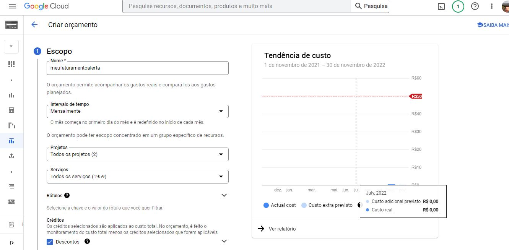
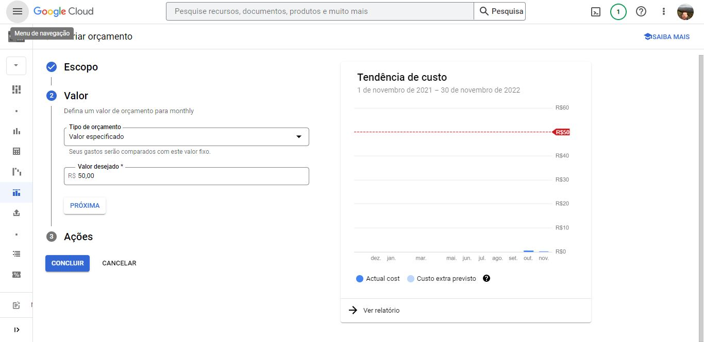
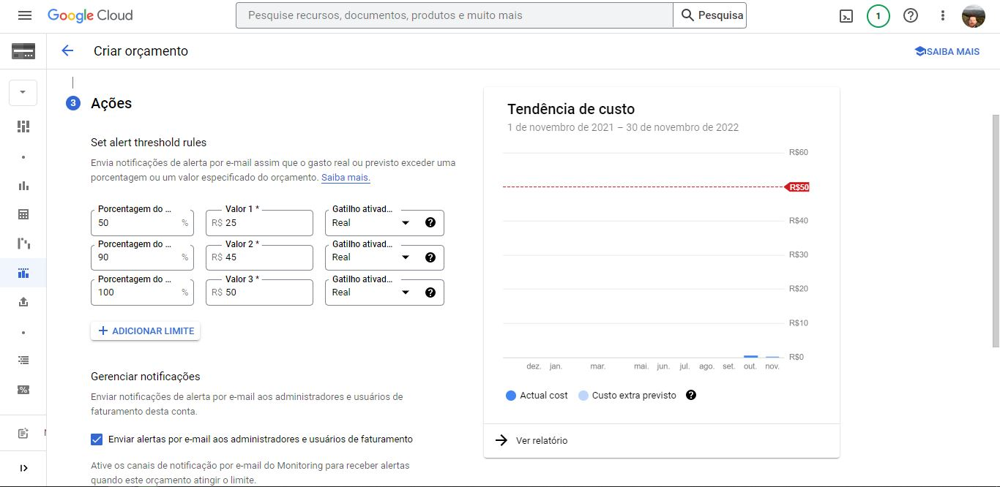
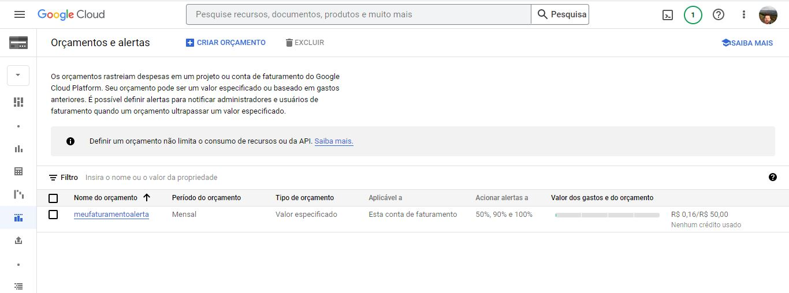

### Olá!!! 👋

  
 Esse repositório contém os prints das configurações de um orçamento e alerta de faturamento no Google Cloud.

  

 

📌 Escopo:

 

 

📌 Valor:

 

 

📌 Ações:

 

 

📌 Concluído:

 

